# 📄 ETL Pipeline - AI-Powered PDF Data Extraction

**An intelligent document processing system that extracts structured data from invoices, contracts, and receipts using multimodal AI agents.**

```mermaid
graph LR
    A[☁️ AWS S3] --> B[📄 PDF Upload]
    B --> C[⚡ Lambda Trigger]
    C --> D{Document Type?}
    
    D -->|Contract| E1[📋 Contract Service]
    D -->|Invoice| E2[🧾 Invoice Service]
    D -->|Receipt| E3[🧾 Receipt Service]
    
    E1 --> F1[🤖 Vision AI Scout or 🐍 Code]
    E2 --> F2[🤖 Vision AI Scout or 🐍 Code]
    E3 --> F3[🤖 Vision AI Scout]
    
    F1 --> G{🤖 Reasoning AI Quality Check}
    F2 --> G
    F3 --> G
    
    G -->|Good| H[💾 AWS RDS PostgreSQL]
    G -->|Needs Review| I[🧠 Vision AI Maverick]
    I --> H
    
    H --> J[📊 Generate Report]
    J --> K[💾 AWS RDS PostgreSQL]
```

**Architecture**: AWS Lambda-triggered pipeline with S3 storage, multimodal AI extraction, and RDS PostgreSQL persistence.

---
## 🎯 What Does This Project Do?

This project automatically reads PDF documents (invoices, receipts, contracts) and extracts important information like:
- Names of companies and people
- Dates and amounts
- Line items and descriptions
- Totals and financial details

The extracted data is validated, stored in a database, and analyzed to generate comprehensive reports.

---

## 🚀 Project Evolution

### Phase 1: Initial Prototype ✅ Complete

**Notebook**: `prototype_solution_notebook.ipynb`

Started with a traditional approach using text extraction tools:
- Read PDFs using standard Python libraries (pytesseract and pdfplumber. No Agents)
- Extract text and tables
- Use AI to structure and score the data

**Challenge Discovered**: **Receipt** photos were difficult to process with traditional OCR. The quality of extraction was inconsistent.

### Phase 2: Specialized Receipt Service ✅ Complete

**Notebook**: `receipts_extraction_service_notebook.ipynb`

**The Breakthrough**: Switched to a **multimodal AI approach** using vision models that can "see" images directly, instead of traditional Python OCR libs.

**Results**: Amazing accuracy! The vision-based system processes 160 receipts with high success rates.

**Key Improvements**:
- ✅ Direct image processing (no OCR needed)
- ✅ Two-tier validation (fast model + reasoning model)
- ✅ Automatic retry for incomplete extractions
- ✅ Normalized database storage (PostgreSQL)
- ✅ Automated markdown reports

### Phase 3: Next Steps 🚀 In Planning

Breaking down the system into specialized services:

1. **`invoice_extraction_service_notebook.ipynb`** - For processing invoices (41 files)
2. **`contract_extraction_service_notebook.ipynb`** - For processing contracts (97 sections)

Each service follows the proven receipt extraction pattern.

---

## 📦 Dataset Sources

The pipeline processes three types of documents from different sources:

### 1. Contract Documents

**Dataset**: Jordan Construction Specifications (`jordan_book/`)

| Attribute | Details |
|-----------|---------|
| **Document Type** | Text-heavy contract specification |
| **Format** | PDF with structured sections |
| **Complexity** | High - 97 sections, multi-page |
| **Source** | [Jordan 2019 Standard Specifications for Construction](https://clients.bolton-menk.com/jordanengineering/wp-content/uploads/sites/44/2019/12/Jordan-2019-Standard-Specifications-for-Construction.pdf) |

**Characteristics**:
- Structured section headers (SECTION XXXX - Title)
- Structured section footers (XXXX ENDSECTION XXX)
- Technical specifications and requirements
- Legal contract language
- Tables and numbered lists

### 2. Invoice Documents

**Dataset**: High-Quality Invoice Images (`invoice_dataset/`)

| Attribute | Details |
|-----------|---------|
| **Document Type** | Business invoices with tabular data |
| **Format** | Mix of images (JPG, PNG) and PDFs |
| **Count** | 41 files |
| **Source** | [Invoices Dataset from Kaggle](https://www.kaggle.com/datasets/osamahosamabdellatif/high-quality-invoice-images-for-ocr) |

**Characteristics**:
- Supplier and client information
- Invoice numbers and dates
- Line items with quantities and prices
- Totals and subtotals

### 3. Receipt Documents

**Dataset**: OCR Receipts Text Detection (`receipts_dataset/`)

| Attribute | Details |
|-----------|---------|
| **Document Type** | Scanned retail receipts |
| **Format** | Images (JPG, PNG) |
| **Count** | 160 files |
| **Source** | [Receipts Dataset from Kaggle](https://www.kaggle.com/datasets/trainingdatapro/ocr-receipts-text-detection) |

**Characteristics**:
- Store/merchant names
- Purchase dates and times
- Individual item listings
- Payment totals and taxes

---

## 🏗️ How The System Works

### Overall Architecture

### Processing Pipeline

Each document goes through 4 main steps:

#### Step 1: Extract

**Purpose**: Parse PDFs and extract key information

| Document Type | Extraction Method | What Gets Extracted |
|--------------|-------------------|---------------------|
| **Contracts** | pdfplumber (text parsing) | Section numbers, titles, content, page ranges |
| **Invoices** | Vision AI (direct image analysis) | Invoice numbers, supplier/client names, dates, line items, totals |
| **Receipts** | Vision AI (direct image analysis) | Store names, dates, purchased items, quantities, prices |

**Key Fields Extracted**:

- **IDs**: Document/invoice/receipt numbers
- **Names**: Contractors, suppliers, stores, clients
- **Dates**: Contract dates, invoice dates, purchase dates
- **Descriptions**: Section content, item descriptions
- **Line Items**: Individual products/services with quantities and prices
- **Financial Data**: Totals, subtotals, taxes, discounts

#### Step 2: Transform & Validate

**Purpose**: Normalize and validate extracted data

**Transformations**:

- Date standardization (YYYY-MM-DD format)
- Currency normalization
- Text cleaning (remove OCR artifacts)
- Schema mapping (different document types → unified structure)

**Validation**:

- Pydantic schema validation (type checking, required fields)
- Data quality scoring (optional LLM-based assessment)
- Completeness checks (missing fields detection)
- Format verification (dates, numbers, currency)

#### Step 3: Load

**Purpose**: Store structured data for persistence and analysis

**Storage Strategy**:

- Normalized relational database (PostgreSQL)
- Separate tables for each document type
- Shared contractors table for unified vendor tracking
- Foreign key relationships for data integrity

#### Step 4: Analyze & Report

**Purpose**: Generate insights and automated documentation

**Analysis Outputs**:

- Processing statistics (success rates, errors)
- Financial summaries (total spending, top vendors)
- Data quality metrics (extraction accuracy)
- Performance tracking (processing times, model usage)

**Report Format**: Automated markdown reports with:

- Executive summary
- Database load statistics
- Top contractors/suppliers ranking
- Most expensive line items
- Extraction method performance comparison

---

## 📊 Current Status

### Completed Services

| Service | Status | Files Processed | Success Rate |
|---------|--------|----------------|--------------|
| **Receipts** | ✅ Complete | 160 images | ~95% |
| **Invoices** | 🚀 TODO | 41 files | - |
| **Contracts** | 🚀 TODO | 1 PDF (97 sections) | - |

### What's Working Now

- ✅ Receipt extraction with vision AI
- ✅ Database storage (PostgreSQL via Supabase)
- ✅ Automated report generation
- ✅ Two-tier validation system
- ✅ Error handling and retry logic

---

## 🎯 Next Development Steps

### 1. Complete Document Services (In Progress)

**Goal**: Create specialized processing for each document type

| Priority | Service | Description | Timeline |
|----------|---------|-------------|----------|
| 1 | Invoice Service | Process 41 invoice files with tabular data | 2-3 hours |
| 2 | Contract Service | Process 1 contract PDF with 97 sections | 3-4 hours |
| 3 | Unified Schema | Connect all services to shared database | 1 hour |

### 2. Production API Development (Planned)

**Goal**: Transform notebooks into production-ready API service

Using the proven [Agent API Cookiecutter Template](https://github.com/neural-maze/agent-api-cookiecutter):

**What This Will Include**:

| Component | Description | Benefit |
|-----------|-------------|---------|
| **FastAPI** | REST API endpoints for document processing | Easy integration with other systems |
| **Docker** | Containerized application | Consistent deployment anywhere |
| **GitHub Actions** | Automated testing and deployment | Quality assurance and fast releases |
| **CLI Tools** | Command-line interface | Developer-friendly local usage |

### 3. Documentation as Development Guide

**This README serves as**:
- ✅ Project overview and goals
- ✅ Architecture explanation with visual diagrams
- ✅ Step-by-step development journey
- ✅ Technical decisions and reasoning
- ✅ Future roadmap and milestones

---

## 💾 Database Design

### Schema Overview

The system uses a **normalized relational database** (PostgreSQL) to store all extracted data.

### Why This Structure?

| Decision | Reason | Benefit |
|----------|--------|---------|
| Separate tables for each document type | Different fields and requirements | Clean, maintainable code |
| Shared contractors table | Same companies appear across documents | Unified company analysis |
| Normalized line items | Receipts/invoices have multiple items | Accurate totals and detailed tracking |
| Foreign key relationships | Data integrity | Reliable queries and reports |
---

## 🛠️ Technology Stack

### Core Technologies

| Layer | Technology | Purpose |
|-------|-----------|---------|
| **Vision AI Models** | Groq Llama 4 Scout | Image to Text |
| **Vision AI Models** | Groq Llama 4 Maverick | Deep reasoning Image to Text |
| **Text AI Models** | OpenAI GPT OSS 20B | Fast text extraction and structuring |
| **Reasoning AI Models** | OpenAI GPT OSS 120B  | Deep reasoning for complex validation tasks |
| **Orchestration** | LangGraph | Workflow management and state handling |
| **Validation** | Pydantic | Schema validation and data integrity |
| **Database** | PostgreSQL (Supabase) | Persistent data storage |
| **ORM** | SQLAlchemy | Database interactions |
| **Analysis** | SQL + Python (Pandas) | Data aggregation and reporting |

---

## 🚀 Setup & Installation

### Prerequisites

- Python 3.11+
- PostgreSQL database (or Supabase account)
- API keys for AI models

### Quick Start

1. **Clone the repository**
2. **Install dependencies**
3. **Configure environment variables** (add your API keys)
4. **Run the notebooks** to process documents
5. **View generated reports** in `data/output/`

---

## 📊 Performance Metrics

### Processing Speed

| Document Type | Average Time | Model Used |
|--------------|--------------|------------|
| Receipt (image) | ~2-3 seconds | Vision AI Scout |
| Receipt (retry) | ~5-8 seconds | Vision AI Maverick |
| Invoice (planned) | ~1-2 seconds | Vision AI Scout |
| Contract (planned) | ~3-5 seconds | Vision AI Scout |

### Accuracy Rates

### Cost Efficiency

| Processing Volume | Estimated Cost | Cost Per Document |
|-------------------|----------------|-------------------|
| 100 documents | ~$0.50 | $0.005 |
| 1,000 documents | ~$4.00 | $0.004 |
| 10,000 documents | ~$35.00 | $0.0035 |

*Costs based on Groq API pricing and typical document complexity*

---

## 🎯 Key Features

### What Makes This System Special

1. **Multimodal AI Processing**
   - Vision models that "see" documents like humans
   - No need for traditional OCR preprocessing
   - Handles handwritten and printed text

2. **Two-Tier Validation**
   - Fast initial extraction for speed
   - Deep reasoning model for difficult cases
   - Automatic retry logic

3. **Production-Ready Architecture**
   - State management with LangGraph
   - Database persistence with relationships
   - Comprehensive error handling

4. **Automatic Quality Assurance**
   - Schema validation with Pydantic
   - Missing field detection
   - Data type enforcement

5. **Insightful Reporting**
   - Automated markdown reports
   - SQL-based aggregations
   - Visual data presentations

---

## 🔮 Future Enhancements

### Planned Features

### Development Roadmap

| Phase | Milestone | Timeline | Status |
|-------|-----------|----------|--------|
| **Phase 1** | Receipt Service | Complete | ✅ |
| **Phase 2** | Invoice Service | 2-3 hours | 🚀 |
| **Phase 3** | Contract Service | 3-4 hours | 📋 |
| **Phase 4** | Unified Schema | 1 hour | 📋 |
| **Phase 5** | API Development | 1 week | 📋 |
| **Phase 6** | Production Deploy | 1 week | 📋 |

---

## 💡 Technical Decisions & Reasoning

### Design Philosophy

This project follows a **pragmatic, iterative approach**:

1. **Start Simple**: Begin with one document type (receipts)
2. **Prove Concept**: Validate the vision AI approach works
3. **Replicate Pattern**: Apply successful architecture to other types
4. **Productionize**: Transform notebooks into API service

### Key Architectural Choices

### Lessons Learned

| Challenge | Initial Approach | Better Solution | Result |
|-----------|-----------------|-----------------|--------|
| Receipt quality | Traditional OCR | Vision AI models | 20% → 95% accuracy |
| Validation speed | Complex two-agent system | Single-pass Pydantic | 10x faster |
| Code organization | One large notebook | Separate service notebooks | Easier maintenance |
| Data storage | CSV files | PostgreSQL database | Better queries & relationships |

